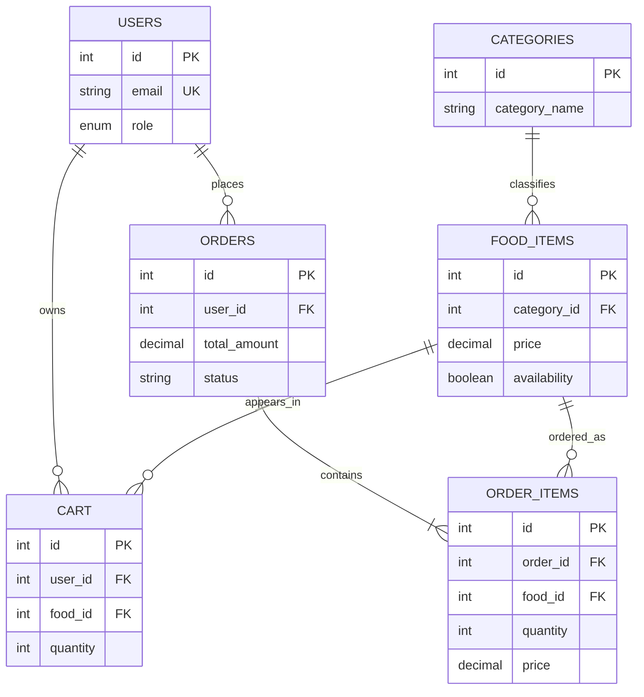

# ER Diagram

```mermaid
erDiagram
  USERS ||--o{ CART : owns
  USERS ||--o{ ORDERS : places
  CATEGORIES ||--o{ FOOD_ITEMS : classifies
  FOOD_ITEMS ||--o{ CART : appears_in
  ORDERS ||--|{ ORDER_ITEMS : contains
  FOOD_ITEMS ||--o{ ORDER_ITEMS : ordered_as
  USERS { int id PK string email UK enum role }
  CATEGORIES { int id PK string category_name }
  FOOD_ITEMS { int id PK int category_id FK decimal price boolean availability }
  CART { int id PK int user_id FK int food_id FK int quantity }
  ORDERS { int id PK int user_id FK decimal total_amount string status }
  ORDER_ITEMS { int id PK int order_id FK int food_id FK int quantity decimal price }
```
